<table>
    <thead>
        <tr>
            <th style="text-align: center;" colspan="2">Pertemuan 1</th>
        </tr>
    </thead>
    <tbody>
        <tr>
            <td><strong>Nama :</strong></td>
            <td>Yayun Eldina</td>
        </tr>
        <tr>
            <td><strong>NIM :</strong></td>
            <td>2241720065</td>
        </tr>
    </tbody>
</table>

---

# **Jobsheet 1 - Setup Environment React**

## **Praktikum 1: Menyiapkan Lingkungan Pengembangan**

### **Create Repository**
Saya telah membuat repository sebagai berikut:

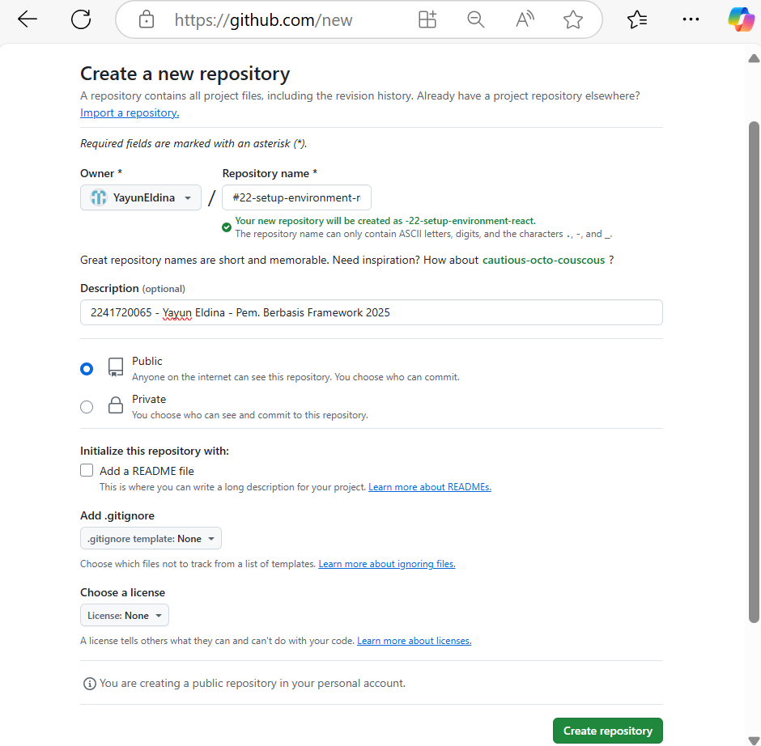

### **Instalasi Node.js**
Berikut adalah tampilan versi Node.js yang berhasil saya install:

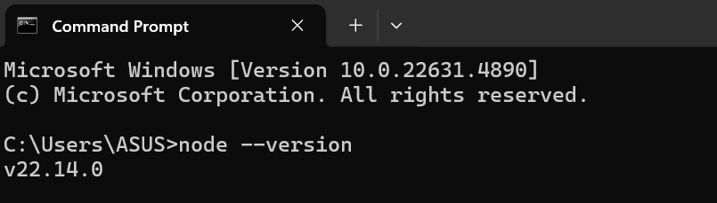

### **Pertanyaan 1**
1. **Jelaskan kegunaan masing-masing dari Git, VS Code, dan Node.js yang telah Anda install pada sesi praktikum ini!**  
   - **Git** → Sistem kontrol versi untuk mengelola perubahan kode, bekerja sama dalam tim, dan menyimpan riwayat pengembangan.  
   - **VS Code** → Editor kode yang ringan dan powerful dengan banyak fitur seperti debugging, terminal terintegrasi, dan ekstensi.  
   - **Node.js** → Runtime JavaScript untuk menjalankan kode di luar browser, sering digunakan dalam pengembangan backend dan alat pengembang.  

2. **Buktikan dengan screenshot bahwa masing-masing tools tersebut telah berhasil terinstall di perangkat Anda!**  
   - **Git**  
     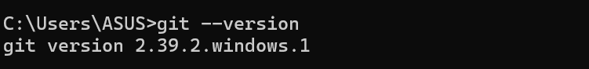  
   - **VS Code**  
     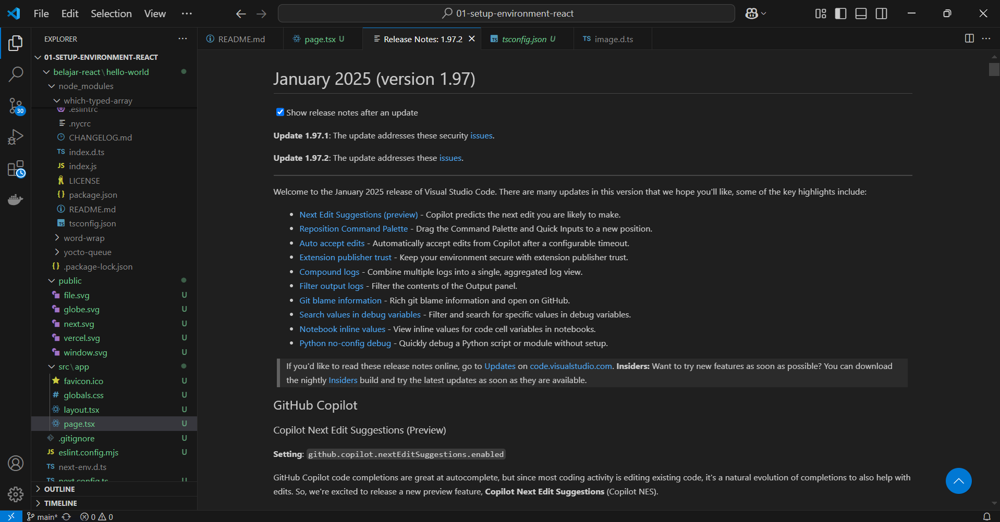  
   - **Node.js**  
     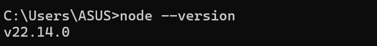  

---

## **Praktikum 2: Membuat Proyek Pertama React Menggunakan Next.js**

1. Membuat folder proyek baru dengan nama **belajar-react**. Masuk ke dalam folder tersebut melalui terminal dan jalankan perintah berikut:
   ```sh
   npx create-next-app
   ```
   

2. Membuat proyek baru dengan nama **hello-world** melalui konsol.
   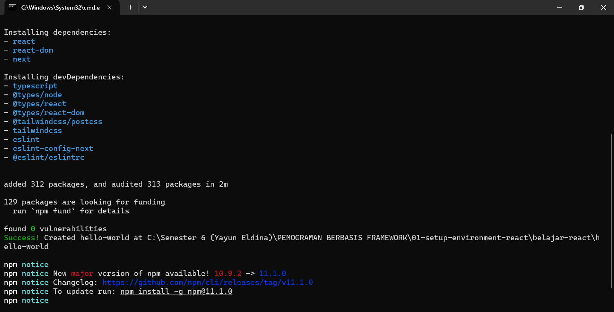

3. Membuka folder proyek **hello-world** menggunakan VS Code dengan perintah:
   ```sh
   cd hello-world
   code .
   ```
   Struktur folder proyek akan terlihat seperti berikut:
   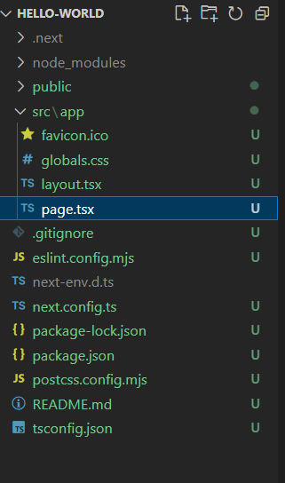

4. Menjalankan proyek **hello-world** dengan perintah berikut:
   ```sh
   npm run dev
   ```
   Setelah proses kompilasi selesai, proyek dapat diakses melalui **http://localhost:3000/**
   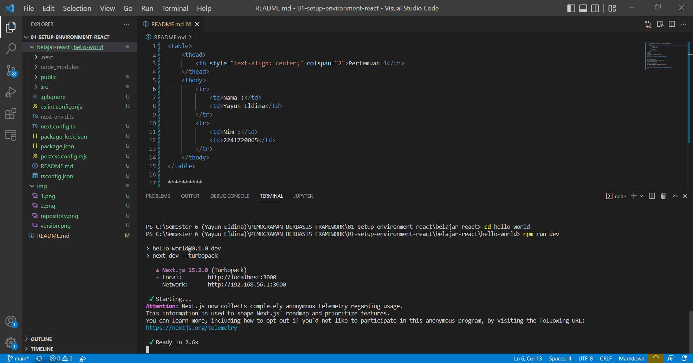

---

### **Pertanyaan 2**

1. **Jelaskan istilah berikut yang muncul setelah membuat proyek Next.js:**
   - **TypeScript** → Superset dari JavaScript yang menambahkan static typing untuk mendeteksi error saat pengembangan, membuat kode lebih aman dan terstruktur.
   - **ESLint** → Alat untuk mendeteksi dan memperbaiki kesalahan dalam kode JavaScript/TypeScript sesuai dengan standar penulisan yang baik.
   - **Tailwind CSS** → Framework CSS berbasis utility-first yang memungkinkan pengembangan UI lebih cepat dan efisien dengan class-class siap pakai.
   - **App Router** → Sistem routing terbaru di Next.js (mulai versi 13), menggantikan `pages/`, dengan pendekatan berbasis folder dalam `app/`, menggunakan Server Components secara default.
   - **Import Alias** → Fitur yang memungkinkan penggunaan path pendek saat mengimpor file dalam proyek.
   - **Turbopack** → Bundler baru untuk Next.js (pengganti Webpack) yang dikembangkan oleh tim Vercel, lebih cepat dalam hot module replacement (HMR) dan proses build.

2. **Kegunaan folder dan file dalam struktur proyek Next.js:**
   - **Folder**
     - `.next/` → Folder ini berisi hasil build dari Next.js.
     - `node_modules/` → Menyimpan semua dependensi yang diinstal melalui npm atau yarn.
     - `public/` → Menyimpan aset statis seperti gambar dan ikon.
     - `src/app/` → Folder utama yang digunakan dalam sistem App Router di Next.js.
   
   - **File di `src/app/`**
     - `favicon.ico` → Ikon kecil yang ditampilkan di tab browser.
     - `globals.css` → File CSS global untuk styling seluruh aplikasi.
     - `layout.tsx` → Template utama untuk semua halaman dalam aplikasi.
     - `page.tsx` → File utama untuk halaman utama (`/`).
   
   - **File Konfigurasi & Lainnya**
     - `.gitignore` → Menentukan file/folder yang diabaikan oleh Git.
     - `eslint.config.mjs` → Konfigurasi ESLint.
     - `next-env.d.ts` → Deklarasi TypeScript untuk Next.js.
     - `next.config.ts` → Konfigurasi Next.js.
     - `package-lock.json` → Mengunci versi package yang diinstal.
     - `package.json` → Berisi informasi proyek dan dependensi.
     - `postcss.config.mjs` → Konfigurasi PostCSS untuk Tailwind CSS.
     - `README.md` → Dokumentasi proyek.
     - `tsconfig.json` → Konfigurasi TypeScript untuk proyek Next.js.

3. **Bukti screenshot dari tahapan percobaan yang telah berhasil dilakukan:**

   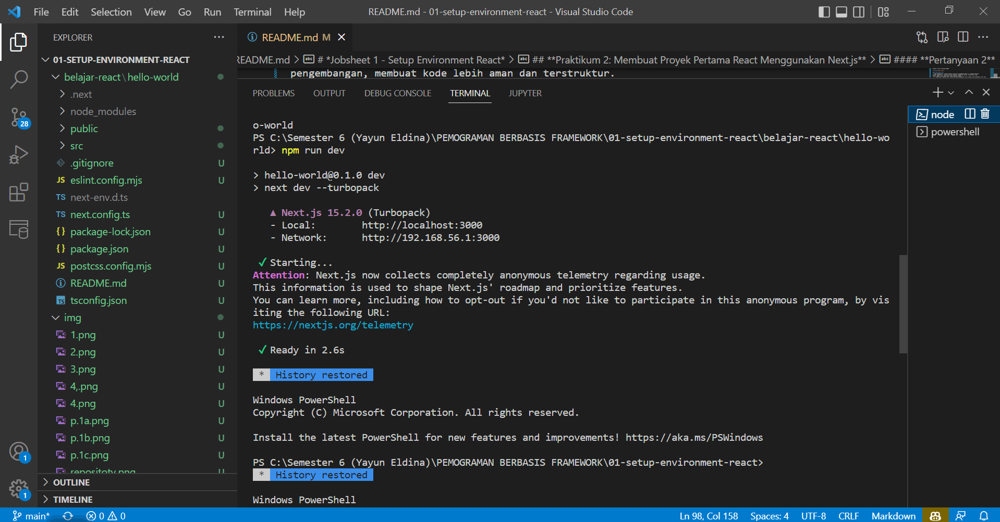

   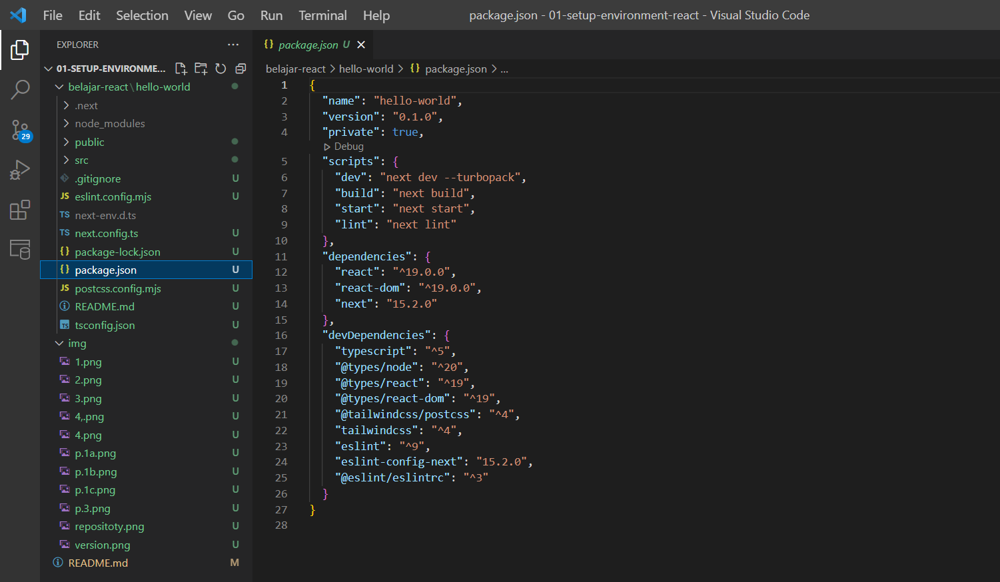


## **Praktikum 3: Menambahkan Komponen React (Button)**
1. Di dalam folder proyek yang telah dibuka di VS Code, buka file page.tsx 
2. Tambahkan fungsi MyButton yang mengembalikan markup komponen button yang akan 
ditambahkan ke dalam webpage 

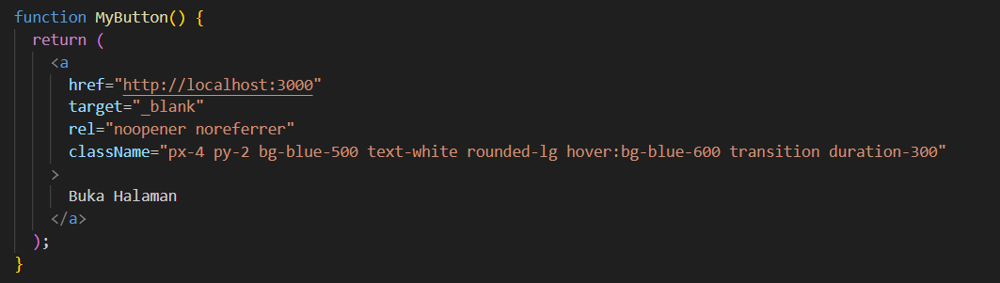

3. Tambahkan komponen button tersebut di samping button Read Our Docs.  

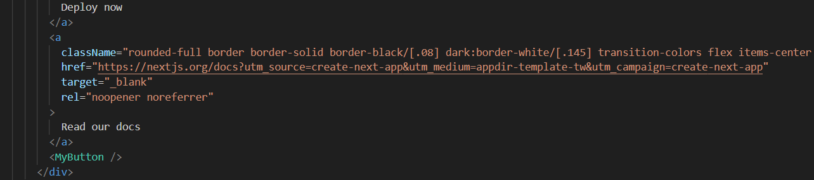

### **Pertanyaan 3**

1. **Buktikan dengan screenshoot yang menunjukkan bahwa tahapan percobaan di atas telah berhasil Anda lakukan!**


## **Praktikum 4: Menulis Markup dengan JSX**

1. Tambahkan kode JSX di bawah ini ke dalam file page.tsx.

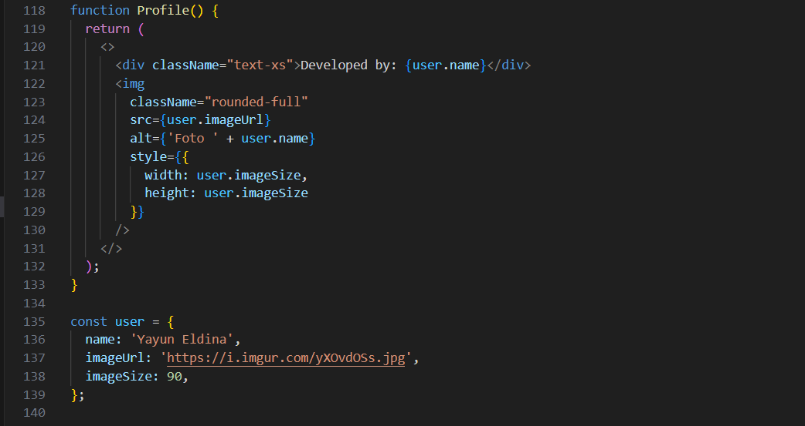

2. Tambahkan komponen MyProfile setelah kompnen MyButton.
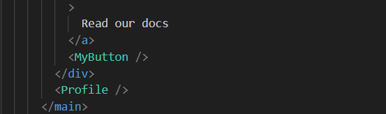

3. Simpan dan amati perubahan di halaman web yang dihasilkan! 
Terjadi penambahan profile pada halaman web yang ditampilkan.

### **Pertanyaan 4**

1. **Untuk apakah kegunaan sintaks user.imageUrl?**
user.imageUrl adalah properti dalam objek user yang menyimpan URL gambar. Properti ini digunakan dalam elemen  untuk menentukan sumber gambar secara dinamis, memungkinkan fleksibilitas dalam menampilkan foto profil pengguna tanpa perlu mengedit kode secara manual setiap kali gambar berubah.

2. **Buktikan dengan screenshoot yang menunjukkan bahwa tahapan percobaan di atas telah berhasil Anda lakukan!**

